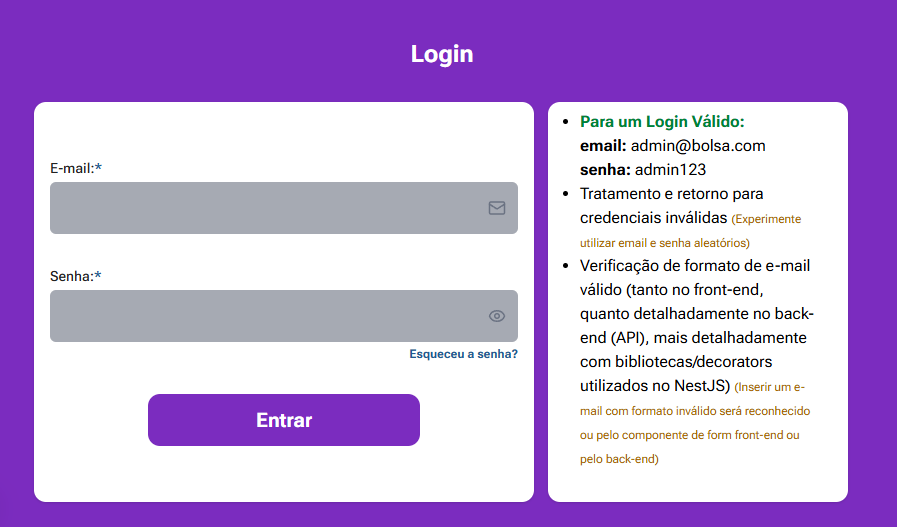
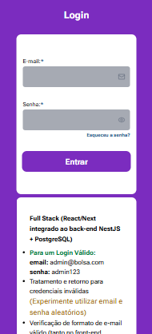

## 🔐 Autenticação/Login – Arquitetura Client-Side (React/Next + Atomic Design)  
### 🧩 Integrado ao meu back-end API em NestJS + PostgreSQL — utilizando **Cookies HttpOnly**

Este módulo de autenticação foi implementado inicialmente em **Client-Side (CSR)** usando React/Next,  
com foco total em componentização (Atomic Design) e clara separação entre UI e domínio.  
O fluxo utiliza **cookies HttpOnly** no processo de login.

  

---

## 🔐 Uso de Cookies HttpOnly – Como funciona

O login não armazena o token em localStorage/sessionStorage.  
A API NestJS devolve um **JWT dentro de um cookie HttpOnly, Secure e com SameSite definido**.

Isso traz benefícios importantes:

- evita ataques XSS (cookie não acessível via JS)  
- melhora compatibilidade com SSR/Server Actions futuramente  
- simplifica regras de segurança e persistência  
- permite renovação de sessão e refresh transparente

No fluxo atual:

1. O usuário envia email + senha (CSR).
2. O Organism de Login envia o POST para a API.
3. A API responde **setando um cookie HttpOnly** contendo o JWT.
4. O front não precisa armazenar nada manualmente.
5. Requests autenticadas já incluem automaticamente o cookie.

O front apenas gerencia **estado de UI**, sem risco de exposição do token.

---

## 🎯 Razão da Escolha (Foco em React + Componentização)

A decisão de iniciar com um fluxo **Client-Side** permanece, mas agora com segurança reforçada:

- demostra domínio de **estado local e formulários controlados**
- construção de **UI Atomic Design** (Atoms → Molecules → Organisms)
- fluxo claro entre login, recuperação, reset etc.
- implementação didática, rápida e compatível com qualquer stack REST
- arquitetura flexível para futura migração para SSR / Server Actions

---

## 🔧 Preparado para Evolução

Com a adoção de cookies HttpOnly, a arquitetura está alinhada com um fluxo muito mais robusto:

Pode evoluir facilmente para:

- **Server Actions** (Next.js 13+)  
- **SSR com autenticação automática via cookies**  
- **rotas protegidas no server-side**  
- **refresh tokens**  
- **logout seguro invalidando cookie**  

E sem reescrever UI, pois a separação está clara:

- **Domínio / regras** → Organisms  
- **UI e estado controlado** → Molecules / Atoms  

---

## 🔑 Integração com JWT (via Cookie HttpOnly)

Mesmo recebendo o token via cookie, toda camada de autenticação continua baseada em JWT:

- a API gera o token  
- grava no cookie  
- o browser envia automaticamente em requests subsequentes  
- o front apenas interpreta respostas para atualizar UI  

Esse modelo é compatível com REST, SSR e futuras server actions.

---

## 📌 Resumo

A implementação une:

✔ **Client-Side + Atomic Design**  
✔ **segurança real com JWT em HttpOnly Cookies**  
✔ **código limpo, desacoplado e pronto para SSR**  
✔ **organização profissional para portfolio**  

Perfeito para demonstrar domínio tanto de UI/UX quanto de boas práticas modernas de autenticação com Next.js + NestJS.

